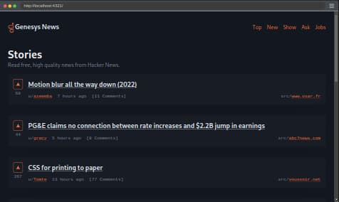

# Genesys News



A [Hacker News](https://news.ycombinator.com/) clone application. The project itself is homework for Genesys. That's how the name originated.

In general, the project is built using the [Astro framework](https://astro.build/). It also utilizes [React](https://react.dev/) to render specific components. Primarily, all components are rendered on the server. The final bundle is a server-side web application.
## Features

- [x] Top stories
- [x] New stories
- [x] Show stories
- [x] Ask stories
- [x] Job stories
- [x] Stories pagination
- [ ] Load comments
- [ ] User profile
- [ ] Login
- [ ] Story submission
- [ ] Story upvote
## Design & UX
The final look and feel are inspired by Piotr Flis's mockup, which you can find on [Dribbble](https://dribbble.com/shots/16463045--Hacker-News-redesign).

## Build
When you build it, you will get a Node-compatible server application.

```sh
pnpm build
```
## Run
To run the Node server, execute the following script. It will start the server on _port 4321_ by default.
```sh
node ./dist/server/entry.mjs
```
For more information visit [Astro docs](https://docs.astro.build/en/guides/integrations-guide/node/).
## Test
### Unit tests
```sh
pnpm test
```
### E2E tests
```sh
pnpm e2e
```
